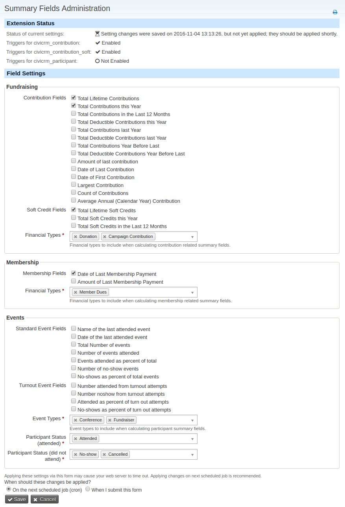

Summary Fields make it easier to search for major donors, recent donors,
lapsed donors as well as to show a synopsis of a donor’s history.
Summary Fields extends your CiviCRM data by creating a tab of fields
that total up and summarize donation history.

Once you've completed set-up, a new tab will appear alongside other tabs
in contact records showing the totals for each individual.

All of the data in the Summary Fields group are calculated from other
data entered into your CiviCRM as contributions, membership or event
participation. The benefit of making these items available as calculated
fields is that they can be searched in Advanced Search and used as a
basis for a smart group as well as for tokens in email and print
communications.

Adding more fields
------------------

This extension provides `hook_civicrm_sumfields_definitions` which allows you to add additional summary fields of your own.
Example:

    /**
     * Implements hook_civicrm_sumfields_definitions()
     *
     * Change "mycustom" to the name of your own extension.
     */
    function mycustom_civicrm_sumfields_definitions(&$custom) {
      $custom['fields']['hard_and_soft'] = array(
        'label' => 'All contributions + soft credits',
        'data_type' => 'Money',
        'html_type' => 'Text',
        'weight' => '15',
        'text_length' => '32',
        'trigger_sql' => '(
          SELECT COALESCE(SUM(cont1.total_amount), 0)
          FROM civicrm_contribution cont1
          LEFT JOIN civicrm_contribution_soft soft
            ON soft.contribution_id = cont1.id
          WHERE (cont1.contact_id = NEW.contact_id OR soft.contact_id = NEW.contact_id)
            AND cont1.contribution_status_id = 1 AND cont1.financial_type_id IN (%financial_type_ids)
          )',
        'trigger_table' => 'civicrm_contribution',
        'optgroup' => 'mycustom', // could just add this to the existing "fundraising" optgroup
      );
      // If we don't want to add our fields to the existing optgroups or fieldsets on the admin form, we can make new ones
      $custom['optgroups']['mycustom'] = array(
        'title' => 'My group of checkboxes',
        'fieldset' => 'Custom summary fields', // Could add this to an existing fieldset by naming it here
        'component' => 'CiviContribute',
      );
    }
